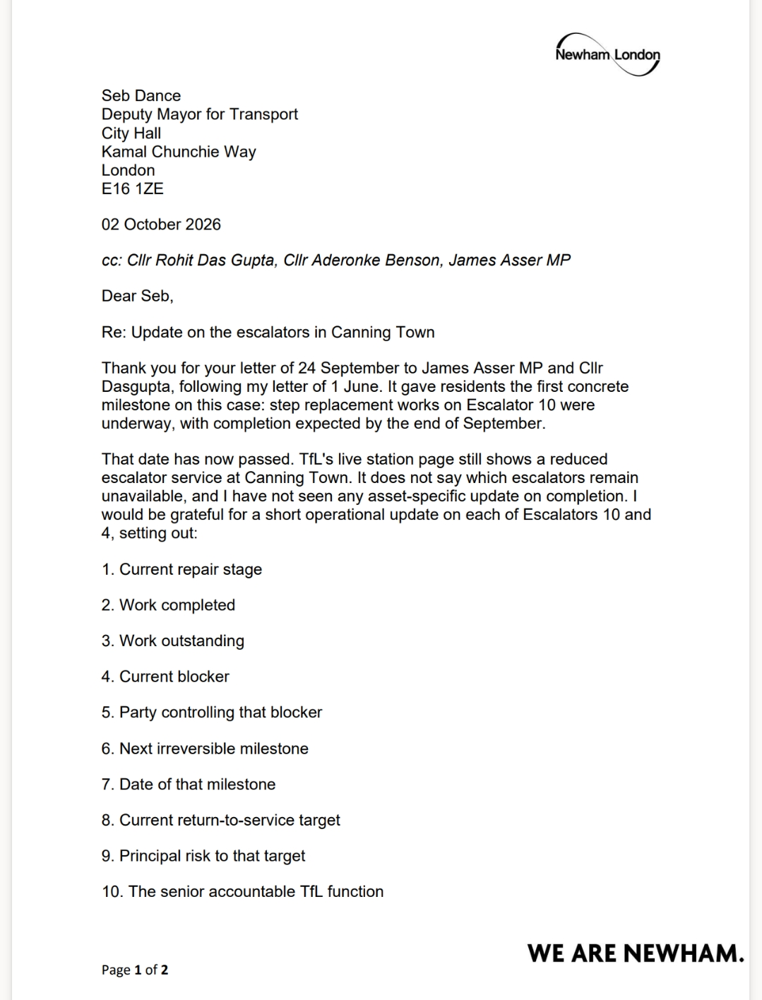
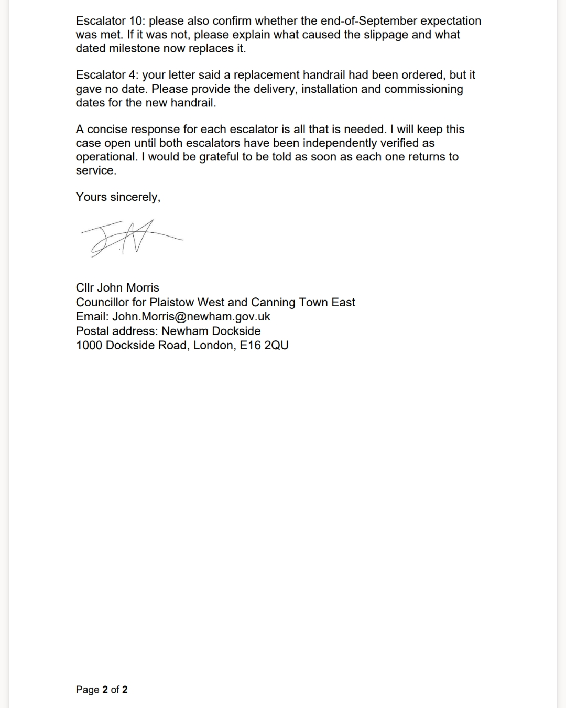

Last week, [Seb Dance, Deputy Mayor for Transport, confirmed](/news/canning-town-escalator-works-underway/) that works to replace the steps on Escalator 10 at Canning Town were underway, with completion expected by the end of September. It was the first firm date residents had been given since the escalator failed.

That date has now passed. TfL's live station page still shows a reduced escalator service at Canning Town. It does not say which escalators are still out of action, and there has been no update on whether the Escalator 10 works have finished.

So on 2 October I wrote to the Deputy Mayor again, asking for a short, clear update on both escalators.

## What I've Asked For

For **each of Escalators 10 and 4**, I've asked TfL to set out:

1. The current repair stage
2. The work completed
3. The work still outstanding
4. What is currently holding things up
5. Who controls that blocker
6. The next milestone that can't be undone
7. The date of that milestone
8. The current target date for returning to service
9. The main risk to that target
10. Which senior part of TfL is accountable

I've also asked two specific questions:

- **Escalator 10:** Was the end-of-September date met? If not, what caused the delay, and what dated milestone now replaces it?
- **Escalator 4:** The Deputy Mayor's last letter said a replacement handrail had been ordered, but gave no date. I've asked for the dates when the new handrail will be delivered, fitted and commissioned.

**Read my letter in full:**

## Why This Matters

Residents have now waited months for these escalators to come back. A date is only worth something if it is met, or if people are told honestly when it slips and why. A general "reduced escalator service" notice doesn't tell anyone whether they can rely on Escalator 10 or 4 on their journey today.

Without working escalators, Canning Town is harder to use for disabled and older residents, parents with pushchairs and anyone carrying luggage. They deserve clear information they can plan around.

## What Happens Next

I will keep this case open until both escalators have been independently checked and confirmed as working, not just reported as fixed. I've asked TfL to tell me as soon as each one is back in service, and I will share their reply here.

Thank you to James Asser MP and Cllr Dasgupta for their continued support on this.

If you use Canning Town station and notice either escalator back in service, or are still having problems, especially if you rely on step-free access, please get in touch with my office.

*— Cllr John Morris*
