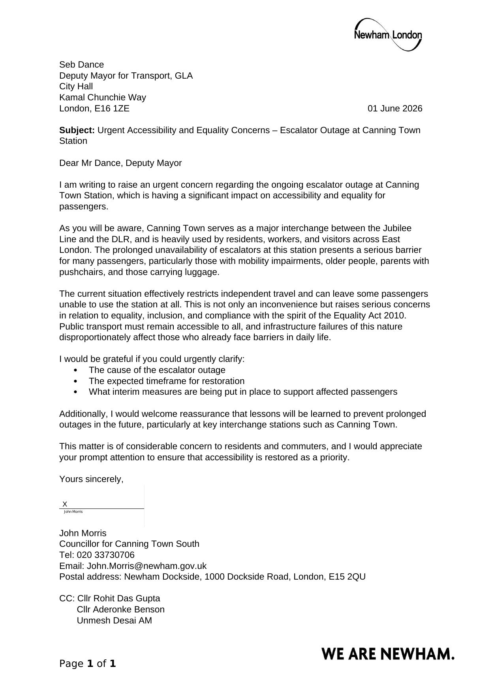

Local councillors in Canning Town are demanding urgent answers from Transport for London (TfL) after an escalator at Canning Town Underground station has remained out of service for months, leaving residents, disabled passengers and commuters struggling to access one of East London's busiest transport interchanges.

## A Station Under Strain

Canning Town station is a critical hub for East London, connecting the Jubilee line, the Docklands Light Railway (DLR), and a wide network of local bus services. Thousands of passengers pass through it every day, including many who rely on step-free access — older residents, disabled passengers, parents with pushchairs, and travellers carrying luggage.

With the escalator out of action for an extended period, that access has been significantly reduced, and both ward councillors say they have been inundated with complaints from frustrated residents.

## Two Councillors, One Message

Both Cllr Dr Rohit Kumar Dasgupta and Cllr John Morris — who jointly represent Canning Town South on Newham Council — have written separately to Seb Dance, London's Deputy Mayor for Transport, urging TfL to treat the repair as a priority.

Cllr John Morris, in a letter dated 1 June 2026, framed the outage as more than an inconvenience, warning that it raises serious questions about accessibility, inclusion, and compliance with the spirit of the Equality Act 2010. He argued that the prolonged fault "effectively restricts independent travel" for some passengers and can leave others unable to use the station at all. His letter was copied to Cllr Rohit Das Gupta, Cllr Aderonke Benson, and London Assembly Member Unmesh Desai.

**Read Cllr Morris's letter in full:**

Cllr Dr Rohit Kumar Dasgupta went further, revealing that this is now the third time he has personally raised the issue with TfL and the Greater London Authority. In his letter, he expressed frustration that despite previous representations, the escalator remains out of service, calling the situation "unacceptable for a major transport interchange serving thousands of passengers each day." He warned that the continued delay is undermining public confidence in TfL's commitment to accessibility and public service in Canning Town.

## What They're Asking TfL to Provide

Although worded slightly differently, both letters converge on the same core demands. Between them, the councillors are asking Seb Dance and TfL to provide:

1. A clear explanation of what caused the escalator outage in the first place.
2. A firm timescale for repair and reinstatement of the escalator.
3. Details of interim measures being put in place to support passengers with accessibility needs while the escalator remains out of service.
4. Assurances for the future — specifically, what steps TfL will take to prevent similarly prolonged outages at Canning Town and other key interchange stations going forward.

Cllr Dasgupta's letter also pushes TfL to consider deploying additional resources to expedite the repair, given the station's strategic importance to the wider network and the disproportionate impact the outage is having on residents and commuters.

## The Bigger Picture

Both councillors frame the escalator outage as symptomatic of a broader accessibility problem rather than an isolated technical fault. With Canning Town serving as one of the borough's most important interchanges, prolonged step-free access failures don't just cause delay — they can shut some residents out of the station entirely.

Having now raised the matter with TfL on multiple occasions, Cllr Dasgupta has made clear that residents "deserve a clear explanation and a firm commitment to restoring full accessibility" at the station, and that he expects a substantive response rather than further delay.

Both letters signal that local representatives intend to keep the pressure on until a working escalator — and a credible explanation for why it took so long — is delivered.
