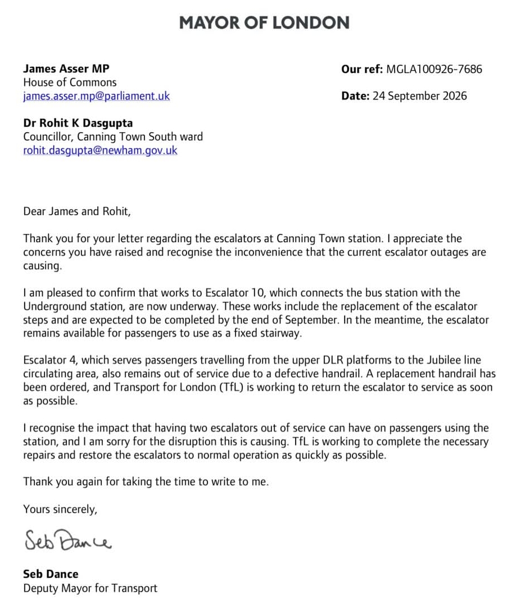

There is finally some progress to report on the escalators at Canning Town station. Seb Dance, Deputy Mayor for Transport, has replied to a letter from James Asser MP and my fellow Canning Town South councillor, Cllr Dr Rohit Kumar Dasgupta. His reply confirms that repair works on Escalator 10 have now started.

This follows [TfL's response in August](/news/canning-town-escalator-update-tfl-response/), when there was no date for the repair because a replacement part had failed to meet safety standards.

## What the Deputy Mayor Has Confirmed

**Escalator 10**, which links the bus station with the Underground station:

- Works are now **underway**, including the replacement of the escalator steps.
- The works are **expected to be completed by the end of September**.
- In the meantime, the escalator **remains available as a fixed stairway**.

**Escalator 4**, which takes passengers from the upper DLR platforms to the Jubilee line circulating area:

- It **remains out of service** due to a defective handrail.
- A **replacement handrail has been ordered**, and TfL says it is working to return the escalator to service as soon as possible. No date has been given yet.

The Deputy Mayor acknowledged the impact of having two escalators out of service at the same time and apologised for the disruption to passengers.

**Read the Deputy Mayor's letter in full:**

## What This Means for Residents

This is welcome news. For the first time since Escalator 10 failed, we have work actually happening on site and a target date for its return. Thank you to James Asser MP and Cllr Dasgupta for keeping up the pressure, and to every resident who reported the problem or got in touch.

We are not there yet, though. The end-of-September date still has to be met, and Escalator 4 still has no confirmed date for its return. Until both escalators are working again, getting around Canning Town remains harder than it should be, particularly for disabled and older residents, parents with pushchairs and anyone carrying luggage.

## What I'll Keep Pressing For

I will keep following this up with TfL, including:

- Confirmation that Escalator 10 is fully back in service by the end of September, as promised;
- A firm date for the new handrail to be delivered and fitted on Escalator 4;
- A longer-term plan to keep the station's escalators reliable, so residents are not left without them for months again.

If you use Canning Town station and are still having problems, especially if you rely on step-free access, please get in touch with my office. I will update this page when I hear more.

*— Cllr John Morris*
