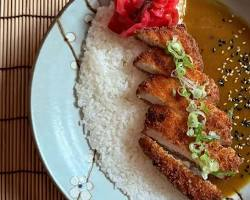
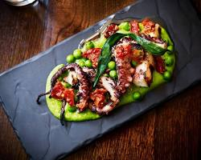
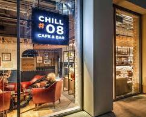
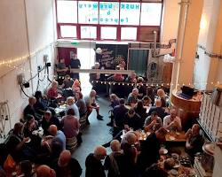
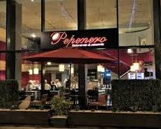
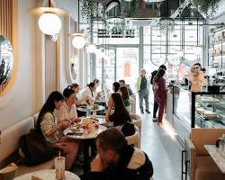
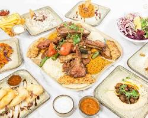
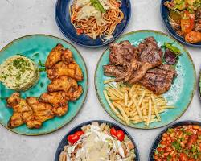
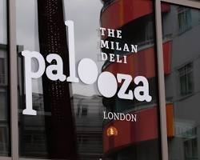
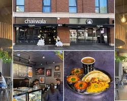

Canning Town has quietly evolved into one of East London's most diverse food pockets. If you are looking to explore the area's food scene, here are twelve top spots to check out, in order.

## MyKopitiam - Canning Town

Bringing the vibrant flavors of Singaporean and Malaysian hawker stalls to East London, MyKopitiam delivers comfort food done right. From rich, aromatic Coconut Nasi Lemak paired with spiced rendang to classics like Hainanese Chicken Rice and Roti John, the kitchen keeps traditional flavor profiles front and center. It is an easy pick if you are craving authentic Southeast Asian street food in a relaxed, informal setting.

## Yapix

Yapix focuses on honest Italian food, serving up pinsa—the lighter, crispier Roman relative of classic pizza—alongside rich pasta dishes and antipasti. The dough is proved over a long period, resulting in a airy, digestible crust that holds up under high-quality toppings like creamy burrata and savory cured meats. Pair your food with a glass of Italian wine, and you have a reliable, low-key spot for evening dining near the station.

## Chill 6

Operating out of the Ibis London Canning Town, Chill 6 (also known as Chill #08) functions as a relaxed bar and lounge hybrid. It is ideal for grabbing a quick, no-fuss meal, whether that means pulling up a chair for a hearty breakfast before catching a train or relaxing with a craft beer and light bar bites in the evening. The space is open, modern, and conveniently located for locals and travelers alike.

## Husk Brewery

If you prefer your meal alongside freshly brewed local beer, Husk Brewery is a standout stop. Situated near the historic docks, this microbrewery serves small-batch craft ales, lagers, and IPAs right where they are made. The taproom frequently hosts local food pop-ups and food trucks, pairing stone-baked pizzas or slow-cooked meats with a crisp pint straight from the tank.

## Charles Artisan Bakery

Charles Artisan Bakery is the local destination for serious bread and pastry lovers. Everything here is made using traditional slow-fermenting sourdough methods, producing loaves with deep flavor and perfect crusts. Beyond their signature loaves, their glass counters are packed with flaky croissants, seasonal fruit tarts, and filled savory pastries that sell out quickly during morning hours.

## MYMA Japanese Restaurant & Cocktails

MYMA pairs Japanese comfort food with an inventive cocktail menu, making it popular for both quick lunches and late dinners. Their kitchen covers everything from steaming bowls of rich ramen and crisp chicken katsu curry to fresh sashimi and delicate rolls. The bar side of the operation handles classic drinks alongside Asian-inspired cocktails infused with yuzu, lychee, and matcha.

## Pepenero

Pepenero delivers standard Italian cooking with a cozy, neighborhood feel. Known for generous portion sizes and a welcoming staff, the menu covers well-loved regional classics including hearty lasagnas, freshly tossed pasta dishes, and crisp pizzas. It is a reliable neighborhood favorite where you can get a solid home-cooked meal without fuss.

## The Milk Tree

The Milk Tree is a stylish, HMC-certified halal café that has made a name for itself as one of the best brunch spots on Barking Road. The menu is built around indulgent breakfasts, including truffle egg croissants, Turkish menemen, stacked pancakes, and Full English variations. On the drink side, they serve up artfully presented specialty coffees, iced pistachio lattes, and matcha creations.

## Saltanat Turkish Restaurant

For serious charcoal grill fans, Saltanat offers authentic Turkish hospitality and high-energy dining. Large platters of adana kebabs, tender lamb chops, and marinated chicken wings arrive straight from the open grill, accompanied by warm flatbreads, fresh salads, and garlic sauce. It is an ideal spot for group dining where sharing a wide variety of grilled meats is the main event.

## Andy's Restaurant

Andy's Restaurant is a classic neighborhood eatery that keeps things straightforward with satisfying, home-style cooking. Offering a mix of traditional British cafe classics, all-day breakfasts, and daily lunch specials, it caters to those who appreciate big portions and friendly, unpretentious service. It is the type of local spot where regular customers are greeted by name over a hot mug of tea.

## Palooza - The Italian Deli

Located in Rathbone Market, Palooza specializes in puccia—a rustic, stone-baked bread native to Puglia that gets packed with ingredients like pistachio mortadella, creamy burrata, and grilled vegetables. Beyond their signature sandwiches, the deli serves hot pasta pots, fresh salads, and an extensive coffee menu featuring everything from espresso to cold brews. It is a great pitstop for a quick, high-quality lunch.

## Chaiiwala

Rounding out the list is Chaiiwala, a popular spot for South Asian street food and hot drinks. Known primarily for its spiced Karak Chai, the menu also features street snacks like crispy samosas, spicy omelette rolls, butter chicken rotis, and sweet gulab jamun. It is an ideal drop-in location for a late-afternoon tea break or a quick, flavor-packed bite on the go.
