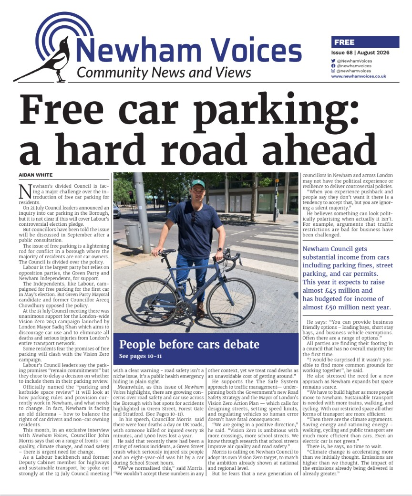

Councillor John Morris has used a high-profile interview in this month's *Newham Voices* to press Newham Council to take a much tougher stance on road safety, arguing that the borough risks falling behind national and regional ambitions if it doesn't act.

Morris, a Labour backbencher and former Deputy Cabinet Member for Highways and Sustainable Transport, spoke out at the Council's 13 July meeting, where members gave unanimous backing to the Mayor of London's Vision Zero 2041 campaign — an initiative aiming to eliminate all deaths and serious injuries across London's transport network.

## "We've normalised this"

In his remarks, Morris pointed to national figures showing roughly four road deaths a day across the UK, with someone killed or seriously injured every 18 minutes and around 1,600 lives lost annually. He argued that society has become desensitised to a toll it would never accept in any other context.

He also referenced recent local incidents that underline the urgency, including a serious crash on Green Street that left six people injured and a separate collision in which a young child was struck by a car during school-street hours.

## Backing the Safe System approach

Morris is a strong advocate of the "Safe System" model of traffic management, which underpins both the Government's new Road Safety Strategy and the Mayor's Vision Zero Action Plan. The approach focuses on redesigning streets, lowering speed limits, and adjusting how vehicles are regulated, so that when human error inevitably occurs, it doesn't prove fatal.

He pointed to encouraging progress already underway — more pedestrian crossings, an expansion of school streets, and evidence that these interventions improve both air quality and safety outcomes. Building on this, he is now urging Newham Council to formally adopt its own Vision Zero target, matching commitments already made at London-wide and national level.

## A warning to newer councillors

Perhaps the most striking part of Morris's intervention was a warning aimed at his newer colleagues. He suggested that some recently elected councillors may lack the political experience or resilience needed to push through road safety measures that can appear controversial, even when they enjoy wider public support than critics assume.

He argued that vocal opposition to schemes like traffic restrictions can create a false impression of public hostility, when in reality it may reflect a smaller but louder minority. To ease concerns from local businesses, he pointed to a range of practical compromises councils can offer, including loading bays, short-stay parking, and exemptions for business vehicles.

## Finding common ground in a divided council

With no single party holding overall control of Newham Council for the first time, Morris struck a note of cautious optimism about cross-party cooperation, suggesting there is more room for consensus than the current political climate might suggest.

He tied the road safety debate to Newham's wider growth pressures, arguing that as the borough's population expands within a limited footprint, walking, cycling, and public transport must play a bigger role — not just for safety, but for climate reasons too. He was blunt in his assessment that even electric vehicles do not offer a genuinely sustainable solution to the borough's transport challenges.

Morris closed with a broader message about urgency, warning that the pace and scale of climate change has outstripped earlier expectations, and that further delay carries a real cost.

**Read the full feature in Newham Voices:**

*Based on reporting in Newham Voices, Issue 68, August 2026.*
