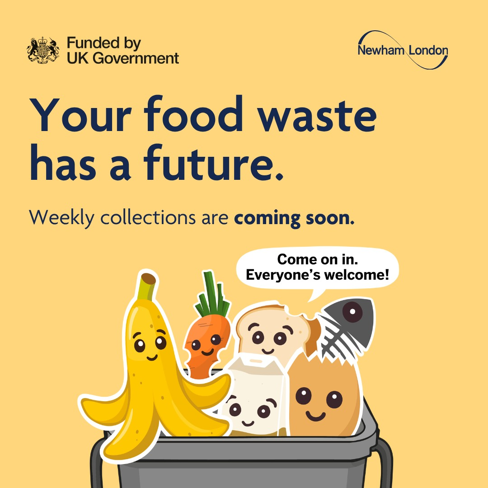
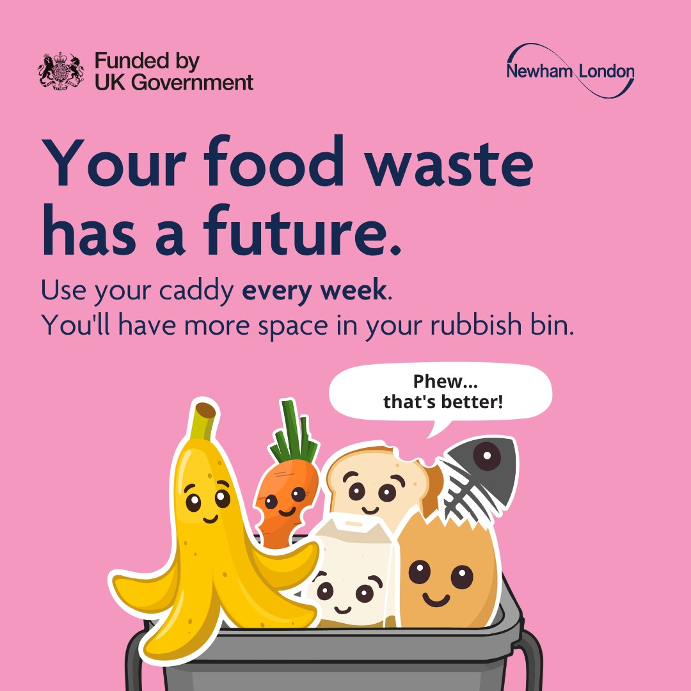

Every remaining street-level home in Newham is getting a weekly food waste collection this autumn. From 12 October 2026, households will start receiving information from the council, followed by their own food waste kit. You can start recycling as soon as yours arrives.

The service is being introduced in response to new UK Government legislation, and its aim is simple: less waste going to the rubbish bin and lower carbon emissions. Around 10% of the borough has already been using it since November 2025. Now it's everyone else's turn to join their neighbours.

## What You'll Receive

Your kit comes through the door in three stages, so you'll know it's on the way before it arrives:

1. An introduction letter explaining the new service.
2. A "coming soon" leaflet.
3. Your food waste kit: a 5-litre kitchen caddy, a 23-litre lockable outdoor food waste bin, an introductory roll of liners and an instruction leaflet.

There's nothing to sign up for. Once your kit arrives, it's ready to use straight away.

## What Goes In

If it's food, it goes in, cooked or raw, fresh or past its best. That includes:

- uneaten food and plate scrapings
- raw and cooked meat, fish and bones
- fruit, vegetables and peelings
- bread, cakes, pastries, rice, pasta and beans
- dairy, cheese, eggs and eggshells
- tea bags and coffee grounds
- mouldy and out-of-date food, including ready meals taken out of their packaging

Please keep these out of your caddy and bin:

- packaging of any kind
- liquids such as milk
- oil or liquid fat
- anything that isn't food

No amount is too small. Even if you rarely throw food away, things like banana skins, tea bags and plate scrapings all add up.

## How to Use It

It takes seconds a day:

1. Line your kitchen caddy and fill it with food scraps. Under the sink, next to the kitchen bin or on the worktop all work well.
2. When it's full, tie the liner and empty it into your outdoor food waste bin. Try not to let the caddy get too full.
3. Put your outdoor bin out by 6am on your normal recycling collection day, with the handle upright so the lid is locked. Leave it at the edge of your property, by your gate or the end of your drive, next to your recycling bin, not on the pavement.

You only get one introductory roll of liners. After that, you can buy liners from a supermarket, use other bags, wrap scraps in paper bags or line the caddy with newspaper. Liners aren't required for collection, but they keep the caddy cleaner. You're also welcome to use your own indoor container if it suits your kitchen better.

Worried about smells? Empty the caddy regularly and tie up the liners. The outdoor bin has a sealable, lockable lid that keeps smells in and pests out.

If your household already has an assisted collection, your food waste will get one automatically. If your bin is missed, you can report it the following day between 10am and 10pm through My Account.

## Where Your Food Waste Goes

Your scraps become renewable energy and fertiliser. Around 40% of the rubbish we throw away is food waste. Recycling it means it's put to good use rather than sent for energy-from-waste treatment with the rest of the rubbish.

Once collected, food waste goes to a local anaerobic digestion facility. There it's broken down into biogas, a renewable energy that can be fed into the National Grid and used in homes and businesses. The process also produces fertiliser that farmers use to grow crops.

Small scraps make a real difference:

- 9 banana peels can create enough energy to fully charge a laptop.
- 6 tea bags can create enough electricity to boil a kettle.
- One full kitchen caddy can create enough electricity to fully charge a tablet.

Recycling food waste also frees up space in your rubbish bin and helps cut carbon emissions.

## Living in a Flat or Above a Shop?

Your turn comes in spring 2027. This autumn's rollout is for street-level homes; all remaining flats and flats above shops join in the third and final phase. Some blocks already have the service from the first phase in 2025.

If your block has a shared outdoor food waste bin but you haven't received a kitchen caddy, you can request the introductory pack through My Account.

## Meet the Scrap Squad

Pop-up events are running across Newham from October to November 2026, and everyone's welcome. Come along to:

- choose and adopt your favourite Scrap Squad character, and give it a name
- make a pledge to recycle your food waste every week
- learn how to use your new caddies
- find out when your service starts and ask any questions

Dates and locations are on the council's pop-up events page.

## Find Out More

Visit [newham.gov.uk/FoodWaste](https://www.newham.gov.uk/FoodWaste) for guidance, FAQs and information in other languages. For anything else, email [recycling@newham.gov.uk](mailto:recycling@newham.gov.uk).

Sharing your own food waste journey online? Use #YourFoodWasteHasAFuture.

## Sources

- Newham Council, Food Waste Collections Phase 2 Campaign Toolkit 2026
- Introducing Weekly Food Waste Recycling Collection, Newham Council
- Your Food Waste Has a Future, Newham Council
- Food waste leaflet for kerbside properties, Newham Council
