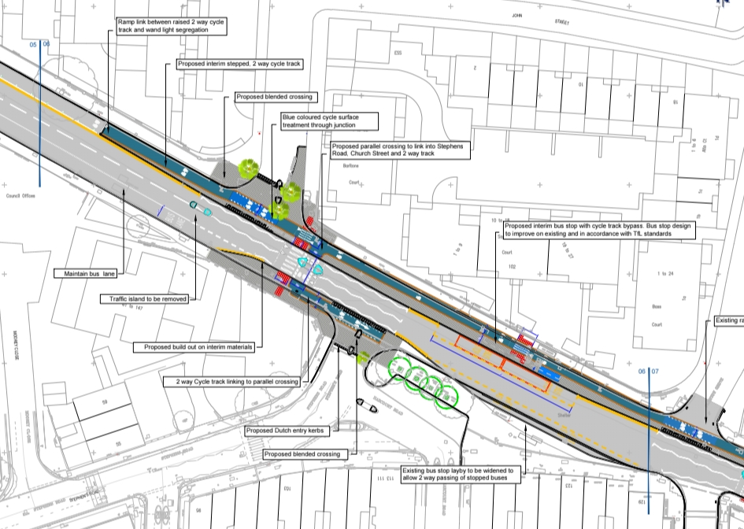
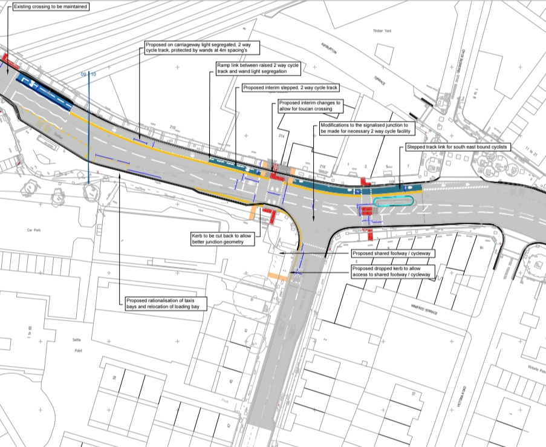
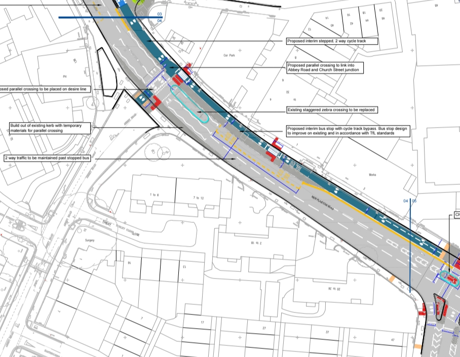
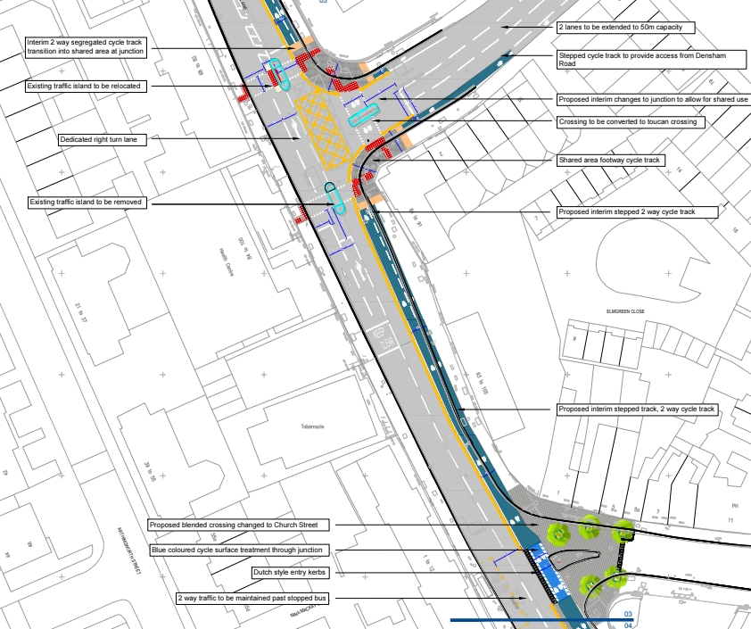
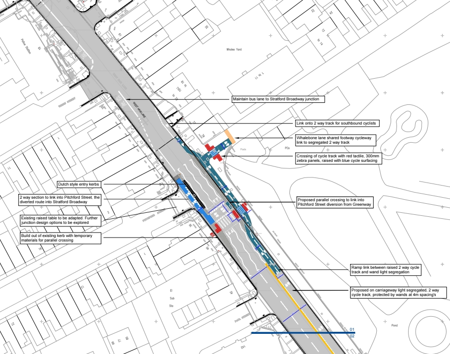

Ask anyone who walks or cycles in Newham what they miss most right now, and there's a good chance they'll say the same thing: the Greenway.

It's worth setting out the whole sequence, because the story has been told in fragments — a closure notice here, a funding figure there — and the shape of it only makes sense end to end.

## The route

The Greenway runs along the top of the Northern Outfall Sewer, linking Plaistow, West Ham, Stratford and Canning Town. It was opened up as a walking and cycling route in the 1990s and upgraded again through investment around the 2012 Games.

For a lot of residents it was never a leisure route. It was the commute, the school run, the way to the station — segregated, step-free and quiet, in a borough where those three things rarely come together.

## September 2024: the closures begin

Thames Water began a major repair programme on the sewer beneath it: structural strengthening and asset renewal at the Manor Road and Corporation Street bridge structures.

The Northern Outfall Sewer was built between 1860 and 1865 and still carries wastewater from north and north-east London to Beckton for around five million people. I'll be straight about this — the work is necessary. Live sewer operations, structural strengthening and bridge works dependent on railway possessions leave very little programme flexibility. Nobody gains from a Victorian sewer failing under East London.

It was also the point at which a lot of people discovered something that still surprises me when I explain it. The Greenway is privately owned by Thames Water and carries a permissive path. It is not adopted public highway.

That distinction does a lot of work. On an adopted road, a council has street works and network management powers — we can regulate works, set conditions, require access to be maintained. On the Greenway we have none of that. We cannot compel it to stay open, and we cannot direct how the works are carried out.

## December 2024: Cabinet commits the funding

With the scale of the disruption becoming clear, Cabinet took a decision on 3 December 2024 to commit up to £3m and progress consultation on a safer alternative walking and cycling route along the A112 corridor — Cycling Future Route 7, the Leyton to Royal Docks link.

The funding is phased rather than a single headline number: £1m from Newham's Active and Sustainable Travel capital programme in 2026/27, and £2.1m in 2027/28, split evenly between the AST programme and Transport for London's Cycling Network Development programme. A separate £1.3m of TfL CND funding covers completion of CFR7 Phase 1.

The practical effect is that design work has been running since then rather than starting now — which matters, given what came next.

## 2025 and 2026: the closure extends

The closure was subsequently widened to cover the route between Upper Road and Channelsea Path, allowing concurrent works at both bridge structures. The current forecast is that the route stays unavailable until at least 2028.

Necessary and painless are not the same thing. Four years is a long time to lose a strategic active travel corridor, and the people carrying that cost are the ones already doing what we've spent a decade asking them to do. The concern from residents, businesses, active travel groups and elected members has been consistent and, in my view, entirely reasonable.

## June 2026: escalation

The Mayor visited the site with Thames Water representatives on 4 June and has since written to the company formally, pressing on four fronts: accelerating the programme, investigating phased or partial reopening before 2028, voluntary financial contributions towards mitigation on the diversion routes, and better communication with residents throughout.

Where you have no statutory levers, this is the lever — persistent engagement at the right level, with specific asks rather than general complaint. Officers have continued that engagement since.

## September 2026: preliminary designs

A report goes to Cabinet on 15 September with the update and the preliminary designs for the alternative route.

Doing nothing was considered and rejected. Displaced walkers and cyclists haven't stopped travelling — they've moved onto busier roads that were never designed for them, particularly the corridors linking Upper Road, Plaistow, West Ham and Stratford.

The package being developed focuses on making those roads genuinely safer: improved pedestrian crossings, cycling infrastructure, speed reduction, junction safety improvements, wayfinding and signage, and accessibility and comfort improvements along the diversion.

Cabinet is being asked to delegate authority to the Director of Highways, Parking and Transportation — in consultation with the Corporate Director for Environment and Sustainable Transport and the Cabinet Member for Adults, Health and Environment — to progress implementation, subject to consultation outcomes.

## What happens next

Statutory and public consultation will follow, taking in residents, businesses, ward members, TfL, active travel organisations and accessibility groups. An Equalities Impact Assessment will accompany the final design, which matters: a flat, traffic-free route is not equally replaceable for every user, and alternatives need assessing on that basis rather than on average journey times.

Wards affected are West Ham, Stratford, Plaistow West and Canning Town East.

The point I'd end on is the word "legacy." This isn't temporary paint that gets scrubbed off when the Greenway reopens. Done properly it leaves the borough with a permanent, high-quality link it would want regardless — which is the difference between mitigating a closure and simply surviving one.

## Proposed designs for the alternative route

Below are the preliminary junction and corridor designs being developed for Cycling Future Route 7 along the A112, showing the proposed cycle track alignment, crossings and bus stop arrangements at each location.

If you use the Greenway, or the roads people have moved onto since it closed, please take part when consultation opens. Lived experience of a junction beats a traffic count every time.

Updates: newham.gov.uk/transport-streets/greenway-closure

*Views expressed here are my own.*
