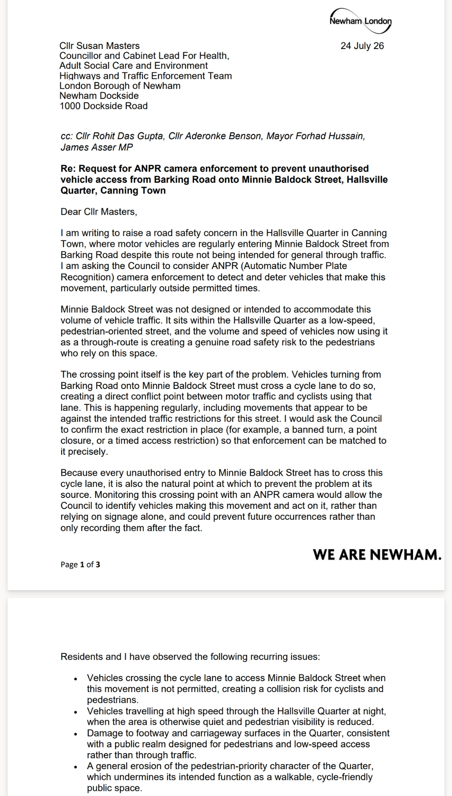
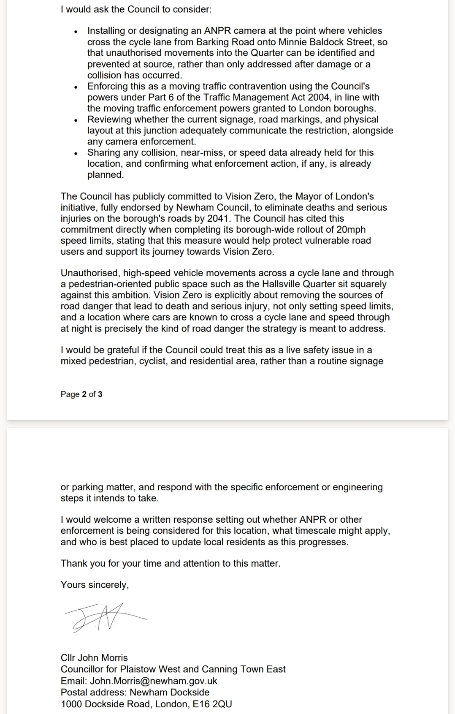

If you live in or near the Hallsville Quarter in Canning Town, you may have already noticed it: cars cutting from Barking Road onto Minnie Baldock Street, a route that was never designed to carry this kind of through-traffic. I've written to Newham Council about it, and I wanted to explain why.

## A street built for people, not through-traffic

Minnie Baldock Street sits inside the Hallsville Quarter as a low-speed, pedestrian-oriented street. It's the kind of space you're meant to be able to walk through without constantly checking over your shoulder. Increasingly, that's not the case. Vehicles are using it as a shortcut, and the volume and speed of that traffic is creating a real safety risk for the people the street was actually built for.

## The cycle lane is the crux of it

To make this cut-through, vehicles have to cross a cycle lane on Barking Road. That's not a minor detail — it's the direct conflict point where a car making an unauthorised turn meets a cyclist who has right of way. It's also, I'd argue, the most useful place to intervene: this movement doesn't just happen anywhere, it funnels through one specific crossing point every time.

Alongside this, there have been incidents of vehicles speeding through the Quarter at night, when the streets are quieter and pedestrian visibility is lower. Combined with visible damage to the footway and carriageway, the picture is of a public space being used in a way it was never designed for.

## What I've asked the Council to do

In my letter, I've asked Newham Council to consider installing or designating an ANPR (Automatic Number Plate Recognition) camera at the point where vehicles cross the cycle lane to enter Minnie Baldock Street. The idea is straightforward: if the crossing point is monitored, unauthorised movements can be identified and discouraged before they cause harm, rather than only being dealt with after a collision or complaint.

I've also asked the Council to:

- Confirm the exact traffic restriction in place at this junction, so enforcement can be matched to it precisely
- Enforce this as a moving traffic contravention, using the powers London boroughs already hold under the Traffic Management Act 2004
- Review whether current signage and road markings are doing enough on their own
- Share any collision or speed data they hold for this location

**Read my letter in full:**

## This is a test of the Council's own commitments

Newham Council has publicly committed to Vision Zero — the Mayor of London's initiative, fully endorsed by the Council, to eliminate deaths and serious injuries on the borough's roads by 2041. The Council pointed to this same commitment when it completed its borough-wide rollout of 20mph speed limits.

A junction where cars are known to cross a cycle lane and speed through a pedestrian space at night is exactly the kind of road danger Vision Zero is supposed to address. Asking for a camera here isn't a request for something extra — it's asking the Council to apply a policy it has already adopted.

## What happens next

I've asked for a written response setting out whether ANPR or other enforcement is being considered, on what timescale, and who's best placed to keep local residents updated. I'll share any update here once I hear back.

If you've noticed the same thing on Minnie Baldock Street, or anywhere else in the Hallsville Quarter, it's worth raising it too — the more people flagging it, the harder it is for the Council to treat this as a one-off.
