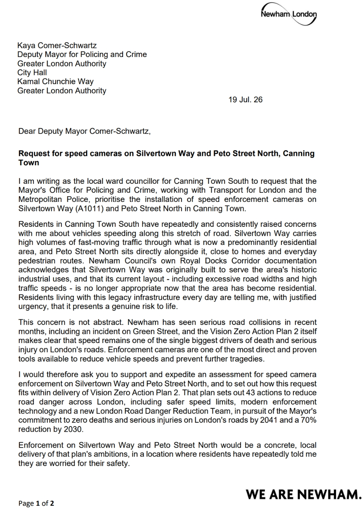
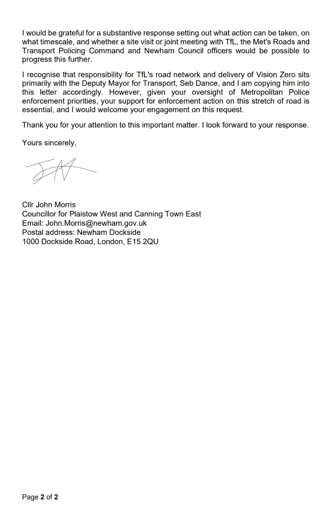

I've lost count of the number of times a resident has stopped me on the street, or messaged me late at night, to tell me the same thing: the traffic on Silvertown Way is out of control, and someone is going to get killed.

They're not exaggerating. They're not being dramatic. They're describing what they see every single day.

Since being elected as your ward councillor for Canning Town South, road safety has become one of the issues I hear about most, and Silvertown Way (the A1011), along with Peto Street North, comes up again and again. These roads run through the heart of a neighbourhood where people live, where children walk to school, where families cross on foot to get to the shops or the station. And yet the traffic moves through it like it's still serving the docks and factories it was built for decades ago.

Because that's exactly what it was built for. Newham Council's own documentation on the Royal Docks Corridor admits as much: Silvertown Way was designed for a different era, when this was an industrial stretch of the borough, not a residential one. The road is wider than it needs to be. Traffic moves faster than it should. And the infrastructure simply hasn't caught up with the fact that thousands of people now call this area home.

That gap between what the road was built for and what it's actually being used for isn't just a planning oversight. It's a safety risk, and it's one that residents are living with every day.

We don't have to look far to see the consequences of speed on our roads. Newham has seen serious collisions in recent months, including on Green Street, and the Mayor's own Vision Zero Action Plan 2 is blunt about the scale of the problem: speed is one of the single biggest causes of death and serious injury on London's roads. That's not a footnote in a policy document. That's the reason people I represent are scared to let their kids cross the road alone.

This is why I've written to the Deputy Mayor for Policing and Crime, copying in the Deputy Mayor for Transport, Seb Dance, to formally request that speed enforcement cameras be installed on Silvertown Way and Peto Street North. I've asked the Mayor's Office for Policing and Crime, Transport for London and the Metropolitan Police to treat this as a priority, not a someday-maybe item on a long list.

**Read my letter in full:**

Enforcement cameras aren't a silver bullet, but they are one of the most direct, proven ways we know of to bring vehicle speeds down and prevent the kind of tragedies that speed causes. Vision Zero Action Plan 2 sets out 43 actions to reduce road danger across London, backed by the Mayor's commitment to eliminate deaths and serious injuries on our roads by 2041, with a 70% reduction by 2030. Safer speed limits, better enforcement technology, a new London Road Danger Reduction Team, it's all there on paper. What I'm asking for is simple: let's turn one small part of that ambition into something real, on a road where residents have been asking for it for years.

I've also asked for something more concrete than a warm response and a promise to "look into it." I want a clear answer on what action can be taken and on what timescale, and I've proposed a site visit or a joint meeting between TfL, the Met's Roads and Transport Policing Command, and Newham Council officers, so we can actually move this forward rather than let it sit in an inbox.

I know these things take time, and I know there are competing demands on every part of London's transport and policing budgets. But road safety isn't a competing demand to me. It's the job. When residents tell me, over and over, that they're frightened for their own safety and their children's safety on a road right outside their front door, I don't think that's something any of us can afford to deprioritise.

I'll keep pushing this, and I'll keep residents updated on what comes back. Silvertown Way and Peto Street North deserve to be treated as what they now are: residential streets, not industrial thoroughfares. Getting speed enforcement in place there is a small, achievable step towards a much bigger promise this city has made to its people, that no one should lose their life simply travelling through their own neighbourhood.

That's why road safety is my priority, and it's why I won't let this request quietly disappear.
