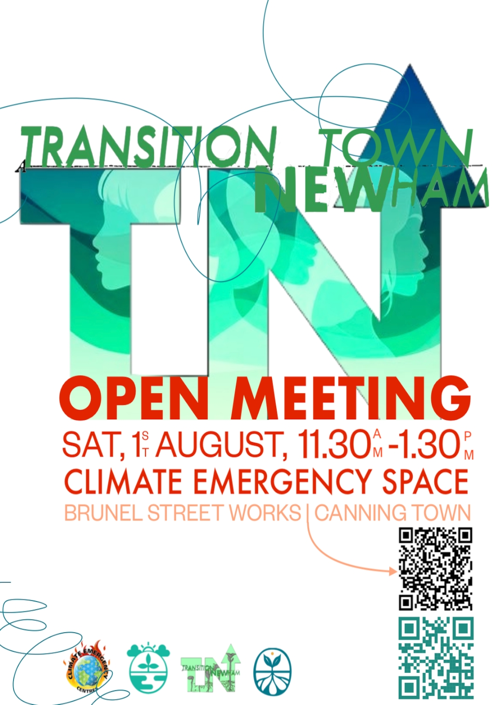

Big changes are landing on and around Silvertown Way this week, with new openings, soft launches, and a community meeting all packed into a few busy days for Canning Town and Hallsville Quarter.

## Holland & Barrett Arrives in Hallsville Quarter

Holland & Barrett has officially opened its doors on Minnie Baldock Way in Hallsville Quarter, bringing the health food and wellness retailer's familiar range of vitamins, supplements, and natural products to the heart of the redevelopment. It's another sign of the steady build-out of retail in the Quarter as the area continues to take shape.

## MyKopitiam Brings Malaysian Flavours to Canning Town

Just around the corner, MyKopitiam has quietly opened its doors for a soft launch. The Malaysian restaurant promises to bring the flavours of a classic kopitiam — Malaysia's much-loved coffee-shop-meets-eatery format — to Canning Town, giving locals a new spot to try dishes like nasi lemak, laksa, and kaya toast without having to travel into Zone 1.

## Lumikha Pan Asian Cafe Opens on Silvertown Way

Right on Silvertown Way itself, at 27 Silvertown Way, E16 1DH, Lumikha is preparing to open its doors as a Pan Asian cafe. The soft launch lands on 1 August 2026, with a grand opening following on 15 August 2026. Expect a menu built around Pan Asian staples, with the cafe's branding hinting at spices, matcha whisks, and traditional teapots. You can follow along at [@lumikha.uk](https://www.instagram.com/lumikha.uk/) on Instagram and TikTok.

## Transition Town Newham Open Meeting — 1 August

Also on Saturday 1 August, from 11:30am to 1:30pm, Transition Town Newham is holding an open meeting at the Climate Emergency Space, Brunel Street Works, Canning Town. It's a chance for locals interested in climate action and community resilience to drop in, hear what the group is working on, and get involved.

## A Busy Start to August

With Holland & Barrett open, MyKopitiam settling in, and both Lumikha's soft launch and the Transition Town Newham meeting sharing the same date of 1 August, this stretch of Silvertown Way and Canning Town is having a genuine moment. Whether you're after a new snack, a hot bowl of laksa, a matcha, or a chance to talk climate action with neighbours, there's a reason to head down this week.
