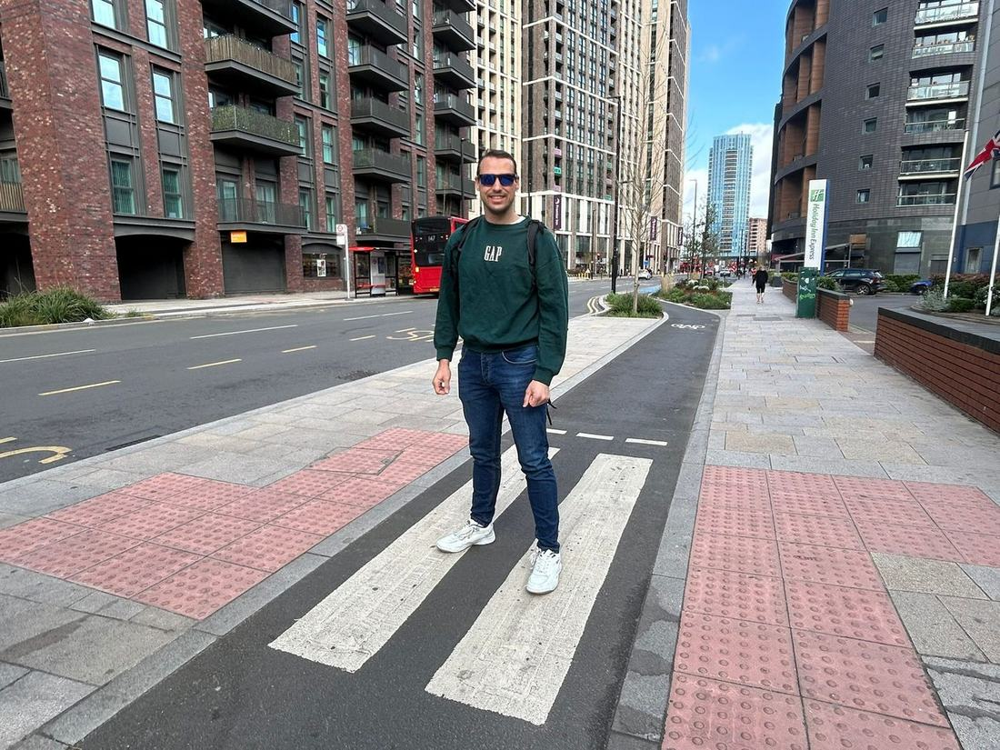
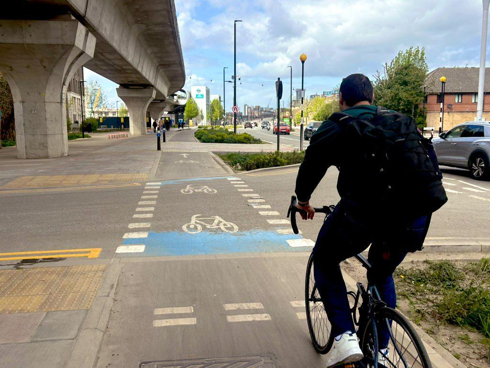
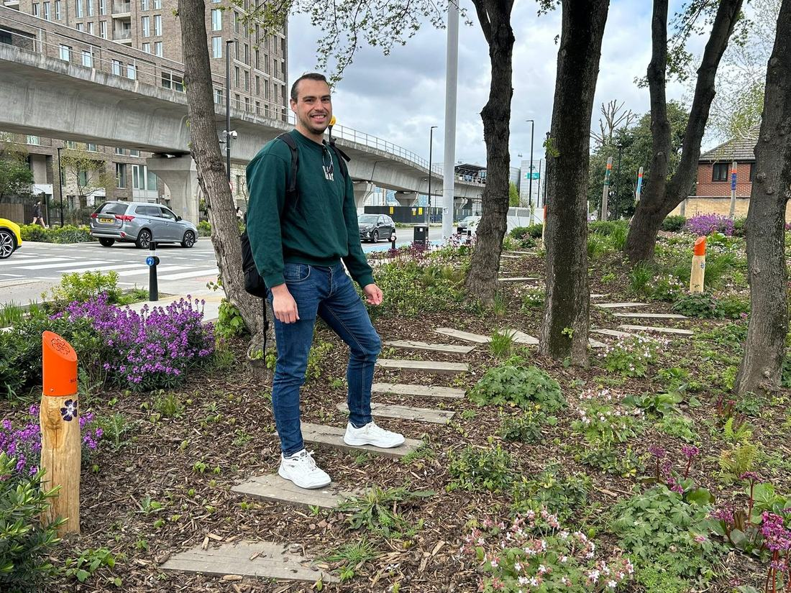

On the 12th of April I met Carla for the first time — the woman, the myth, the legend — and we went and cycled the Royal Docks Corridor together. Honestly, it might be the best thing Newham Council has built for active travel in the last four years, and I say that as someone who's followed this scheme since it was still just lines on a map.

I first heard about it properly when I got appointed Deputy Cabinet Member for Highways and Sustainable Transport, back when the portfolio was held by James Asser (now our MP for West Ham and Beckton). My very first job in that role was scrutinising the Council's Active Travel Capital Programme before it went to Cabinet for sign-off. So I've watched this one for a while.

## What actually is the RDC?

If you haven't heard of it: the Royal Docks Corridor is the big transport and regeneration project running through the Royal Docks and Canning Town. It takes roads that were basically built for lorries — Silvertown Way and North Woolwich Road were designed decades ago to move heavy goods traffic in and out of the docks — and turns them into something people can actually walk and cycle along.

That mattered because the docks themselves aren't doing that job anymore. The area's become a major regeneration zone (it's an Enterprise Zone now, which is the bit that unlocks investment), and there are tens of thousands of new jobs and homes planned for the coming decades. You can't bolt that kind of growth onto roads designed in a completely different era for a completely different purpose. Something had to change, and rather than just widening roads for more cars, the Council went the other way — sustainable transport first.

## Why the old roads didn't work

Before the redesign, this stretch was wide, fast, and genuinely hostile if you weren't in a car. Not enough crossings, no proper cycling provision, and speeds that made it feel like somewhere you passed through rather than somewhere you'd want to stop. The redesign tackles that head-on: segregated cycle lanes, wider pavements, more crossings in sensible places, and better links into the DLR stations and bus routes along the route.

It's all built around the Mayor's Healthy Streets principles — less vehicle dominance, lower speeds, more reasons to actually spend time on the street rather than just get through it. New public spaces, better lighting, more of a sense that this is somewhere, not just a road.

There's a strong environmental thread running through it too — new trees, planting, sustainable drainage systems (SuDS) doing double duty managing surface water and supporting biodiversity. It's not just a transport scheme dressed up nicely; it's doing real public health and environmental work as well.

## How it's been delivered

Work started in 2022 and has gone in phases, deliberately, to avoid strangling the area with disruption all at once. Early phases focused on stretches around Oasis Academy and West Silvertown, and by 2025 most of the corridor was done. There's even been a bonus extension — the Western Gateway junction — funded off the back of £3.37 million in savings against the original £21 million budget, largely down to sourcing materials in bulk from cheaper suppliers.

End result: continuous segregated cycling all along the route, much safer crossings, better pedestrian links, and a corridor that finally talks to public transport properly instead of ignoring it. Plus it just looks nicer — more green, more places, more reasons to be there rather than just move through it.

## The ride itself

Right, the actual 12th of April bit. Carla and I started at Canning Town station and headed down to Tidal Basin Road to have a look at Phase 6. Slight hiccup — the Forest bike I'd booked wasn't playing ball — so we abandoned that plan and picked up a Santander bike from East India DLR instead.

From there it was just a genuinely lovely, traffic-free ride: cable cars overhead, the O2 in view, and those views across the docks that never quite stop being a bit surreal for east London. Carla got some great photos — it really does feel like a proper "wow" moment on a bike, which isn't something I say about many roads in Newham. We also got to try out the newly improved Lower Lea Crossing along the way.

We picked the corridor back up via Silvertown Way, went under the viaduct, and along North Woolwich Road to Silvertown Garden — a lovely little pocket of green that's doing real work for biodiversity and flood mitigation, not just there to look pretty.

Kept going along North Woolwich Road past a few different SuDS setups, then reached Connaught Bridge, where the public realm design has actually carved out proper space for young people to skateboard — a nice touch, and one that gets used. Looped back along the south side of North Woolwich Road, where I pointed Carla towards the play areas and the planting tucked in around the drainage systems, and spotted a brand-new Brompton hire bike on the way before we wrapped up back at East India DLR.

## The bigger picture

What strikes me most about the RDC, cycling it again with fresh eyes through Carla's reaction, is how much of a mindset shift it represents. This isn't "how do we squeeze more traffic through here" — it's "how do we make this a place people actually want to be." And it's doing that while still enabling all the growth the Royal Docks are meant to deliver over the next couple of decades.

It won't fix everything overnight, and there's plenty still to do elsewhere in the borough. But as a template for what active travel infrastructure can look like when it's done properly, this one's hard to beat.
