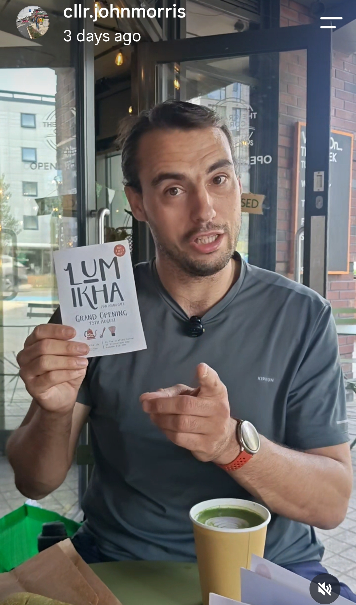

On Saturday I headed along to the Transition Newham open meeting to talk about how our borough can move toward a greener, more sustainable future. It was great to be joined by local environmental activists and community groups, and we got stuck into some meaty topics: community outreach, governance, and financing. These are the unglamorous but essential building blocks of any real climate action, and it's exactly the kind of grassroots work that makes bigger changes possible down the line.

## Community outreach, governance and financing

A lot of the discussion focused on how you actually get residents involved in climate action beyond the people who are already engaged, how a group like Transition Newham should organise itself to keep momentum going, and how to fund the work once the enthusiasm is there. None of it is flashy, but it's the difference between a good idea and something that actually sticks.

## A soft-launch treat at Lumikha

*Me talking, with no mic.*

Afterwards, I popped into Lumikha, a great new spot inside The Crafted Corner arts venue at 27 Silvertown Way, Canning Town, E16 1DH, for a soft-launch treat: an ube matcha latte and a pandan/ube roll. They're fully launching on 15 August, so if you're nearby it's well worth a visit once the doors properly open.

The only downside? I realised afterwards that I'd forgotten to turn my mic on while trying to film a video about the place. Guess I'll just have to go back!
