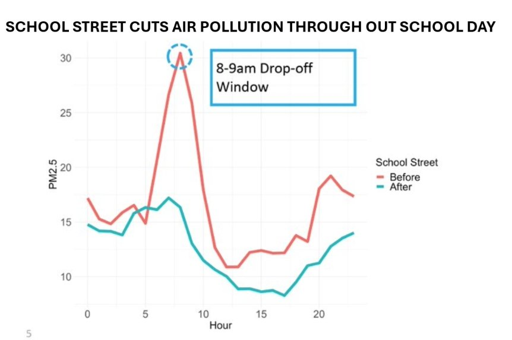

I had the job of welcoming Dr Will Norman, the Mayor of London's Walking and Cycling Commissioner, to Newham Council's October meeting, opening my introduction by thanking him for taking the time to come and address the chamber directly. He called it "a privilege to be here" before delivering one of the more wide-ranging speeches I've heard on what our road safety and clean air policies are actually achieving.

## A sobering starting point

Norman didn't open with good news. He reminded the chamber of the human cost of road danger first: 110 people killed on London's streets last year in crashes and collisions, with over 3,500 seriously injured across the last three years. Closer to home, he said Newham's own roads have seen 15 fatalities and more than 4,000 people hurt.

## The turnaround

But he was quick to point to what's changing. Last year was the lowest on record outside the pandemic for fatalities, and London's collision numbers are falling four times faster than the national average — Norman credited our borough-wide 20mph limit as a major factor in that.

He cited new research showing our 20mph policies have contributed to a 40% fall in fatalities and a 34% fall in serious injuries locally. Most strikingly, he said the borough has seen a 75% fall in the number of children killed on London's roads as a result.

"There are literally people walking around Newham today who wouldn't have been, had it not been for the efforts of everybody in this chamber," Norman told councillors. It's not an easy line to hear applied to your own work, but it's exactly the reminder I think we all needed.

## School streets and cleaner air

He also highlighted our Healthy School Streets programme — 51 of Newham's 127 schools now have a scheme in place — noting a significant fall in traffic volume around those schools, and that we've exceeded our target for the proportion of children walking to school daily.

Norman spoke personally about how distressing it is to see a child suffer an asthma attack, before presenting air quality monitoring data gathered from schools across London. It showed something I hadn't fully appreciated until he laid it out this way: air quality improves not just at drop-off and pick-up, but throughout the entire school day at schools with the scheme.

That means pupils at those 51 Newham schools are breathing cleaner air continuously while they're at school, not just for the hour either side of the bell. Norman put the scale of that achievement in context too: London was once projected to take around 194 years to bring its air quality within legal limits. The city and its boroughs have done it in nine.

## Health benefits beyond the roads

Norman referenced a conversation with England's Chief Medical Officer, Chris Whitty, who told him active travel is having more of an impact than almost anything else on health outcomes and inequalities.

He also brought up a recent visit with the Mayor and me to open new bike lanes as part of the North Woolwich corridor transformation, where we heard from secondary school pupils walking to school safely and watched cyclists using the new infrastructure — the same corridor I wrote about after riding it myself back in April.

Summing up, Norman told councillors our work is reducing asthma attacks, heart disease, diabetes, cancer and depression across the borough: "Keep up the good work. We'll keep supporting you, but the impact that you are making is genuinely astonishing, and you should be proud of it."

## The bigger picture

It's worth being honest about why this mattered to hear right now. With elections on the horizon, some candidates may well campaign on rolling these policies back — reversing school streets, returning to a 30mph limit. Norman's speech was a reminder, backed by hard data rather than opinion, of exactly what's at stake if we do.

The full speech can be viewed on Newham Council's YouTube channel.
